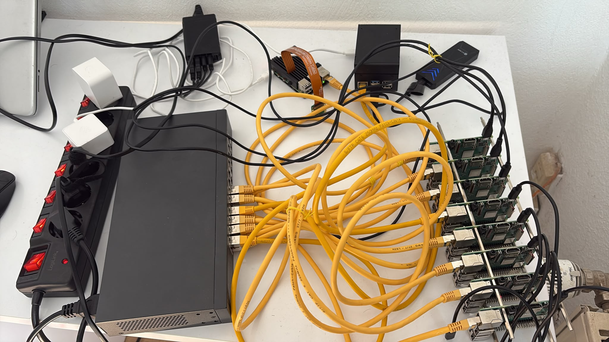

# System Architecture - A Holistic Overview

The system combines edge image acquisition, Kubernetes orchestration, distributed storage, and monitoring to perform real-time object detection while minimizing network bandwidth usage.

The architecture is organized into three layers:

- Hardware Architecture
- Network Architecture
- Software Architecture

---
## Hardware Architecture

[](images/hardware_architecture.png)

The cluster consists of eleven Raspberry Pi devices connected through a dedicated Gigabit Ethernet network.

| Device | Quantity | Operating System | CPU Architecture | Purpose |
|----------|---------:|-----------------|-----------------|---------|
| Raspberry Pi 5 | 1 | Raspberry Pi OS (64-bit) | AArch64 | Kubernetes control plane, application host, PXE boot server |
| Raspberry Pi 4 | 1 | Raspberry Pi OS (64-bit) | AArch64 | Camera node and edge image acquisition |
| Raspberry Pi 3 Model B | 8 | Raspberry Pi OS (64-bit) | AArch64 | Kubernetes worker nodes and distributed computing |
| Raspberry Pi AI Camera | 1 | — | — | Image capture |

In addition to the devices above, following are also an important part of the architecture:

| Device | Quantity | Storage | Size | Purpose |
|----------|---------:|-----------------|-----------------|---------|
| SSD | 1 | Yes | 500GB | Main storage device |
| Pendrive | 1 | Yes | 128GB | Backup Device |
| AI Hat | 1 | No | - | Additional AI Power |

The Raspberry Pi 5 is connected to an external SSD that serves as the primary persistent storage for the Kubernetes cluster. A USB flash drive attached to the Raspberry Pi 4 is used for backup replication.

This is our hardware setup:

[](images/hardware_setup.jpeg)

---

### Hardware Responsibilities

#### Raspberry Pi 5

The Raspberry Pi 5 is the central server of the cluster and performs multiple infrastructure roles.

It hosts:

- K3s Kubernetes Control Plane
- PXE Boot Server
- DHCP Server
- TFTP Server
- NFS Server

The Pi5 also exports the shared root filesystem used by all Raspberry Pi 3 worker nodes during network boot.

---

#### Raspberry Pi 4

The Raspberry Pi 4 acts as the edge sensing device.

It is connected directly to the Raspberry Pi AI Camera using the CSI interface and is responsible for

- capturing camera frames
- preprocessing images
- sending JPEG images and metadata to the backend service
- storing backup replicas on attached USB storage

The Pi4 does **not** perform AI inference. Instead, it forwards captured images to the backend running inside Kubernetes.

---

#### Raspberry Pi 3 Worker Nodes

Eight Raspberry Pi 3 devices form the Kubernetes worker layer.

Each worker node runs

- Raspberry Pi OS (64-bit)
- K3s Agent
- Node Exporter
- MPI/HPL benchmark software
- Task Distributor workers

These nodes are diskless and boot entirely over the network using PXE.

---

## Network Architecture

All Raspberry Pi devices are connected through a dedicated Gigabit Ethernet switch, forming a private local area network.

The Raspberry Pi 5 has a static IP address and provides all boot services required by the worker nodes.

Network services include

- DHCP
- PXE Boot
- TFTP
- NFS

```text
                         Internet
                            |
                     WiFi Connection
                            |
              +-------------+-------------+
              |                           |
        Raspberry Pi 5             Raspberry Pi 4
      (SD Card Boot - Boot Server)       (SD Card Boot)
              |                           
              |                      
              |
        Gigabit Ethernet Switch
              |
   +----------+----------+----------+----------+
   |          |          |          |          |
 RP3-01     RP3-02    RP3-03   ...       RP3-08
 Worker     Worker    Worker             Worker
(PXE Boot) (PXE Boot)(PXE Boot)         (PXE Boot)
```

### PXE Boot Process

The Raspberry Pi 3 worker nodes boot without local storage.

The boot sequence is:

1. Worker powers on.
2. DHCP request is sent to the Raspberry Pi 5.
3. Raspberry Pi 5 assigns an IP address.
4. TFTP downloads the boot files.
5. Linux kernel starts.
6. Root filesystem is mounted from the Pi5 through NFS.
7. K3s Agent starts automatically.
8. Worker joins the Kubernetes cluster.

This allows centralized operating system management and eliminates SD card maintenance across the worker nodes.

---

## Software Architecture

The software stack is deployed on a K3s Kubernetes cluster.

The Raspberry Pi 5 hosts both the Kubernetes control plane and the application workloads.

The Raspberry Pi 3 devices provide additional compute resources for distributed workloads.

The software architecture consists of

- Frontend
- Backend
- Storage
- Monitoring
- Configuration Management

---

### Frontend

The frontend is deployed as a Kubernetes Deployment containing a React application served through Nginx.

Users access the dashboard through Traefik Ingress.

The dashboard provides

- Recent detections
- Annotated images
- Event history
- Alert status
- Storage information
- Cluster monitoring
- System health

---

### Backend

The backend is implemented using FastAPI.

Its responsibilities include

- receiving uploaded frames
- running YOLO inference
- generating annotated images
- creating detection events
- generating alerts
- storing images
- sending Telegram notifications
- serving REST APIs to the frontend

Only lightweight event information is transmitted to users instead of continuous video streams.

---

### Storage

Persistent data is managed using SeaweedFS.

The storage layer contains

- SeaweedFS Master
- SeaweedFS Filer
- SeaweedFS Volume Server
- SeaweedFS S3 Gateway

Persistent volumes are stored on the external SSD connected to the Raspberry Pi 5.

Critical data is periodically replicated to external USB storage attached to the Raspberry Pi 4.

---

### Monitoring

Cluster monitoring is implemented using Prometheus and Grafana.

Every Raspberry Pi runs Node Exporter, exposing metrics such as

- CPU utilization
- Memory usage
- Temperature
- Network traffic
- Disk usage

Prometheus periodically scrapes these metrics.

Grafana visualizes system performance through dashboards.

Alertmanager generates infrastructure alerts when predefined thresholds are exceeded.

---

### Configuration Management

Application configuration is managed through Kubernetes resources.

Configuration includes

- ConfigMaps
- Kubernetes Secrets

This separates configuration data from application code while allowing secure management of sensitive information.

---
## The Complete Story
After combining all above, we get the complete system architecture of PiWatch. 

[](images/system_architecture.png)
