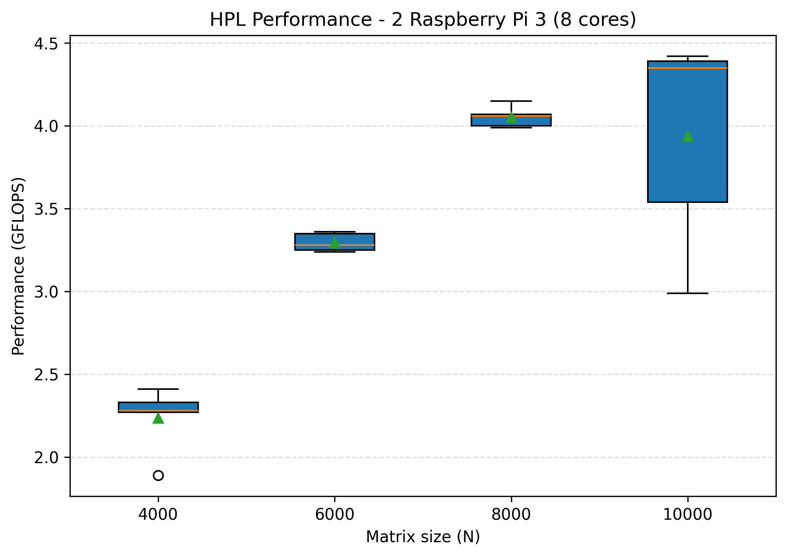
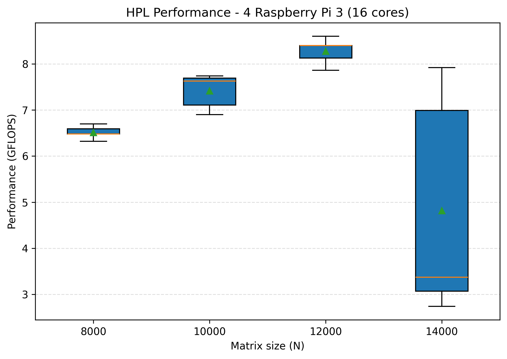
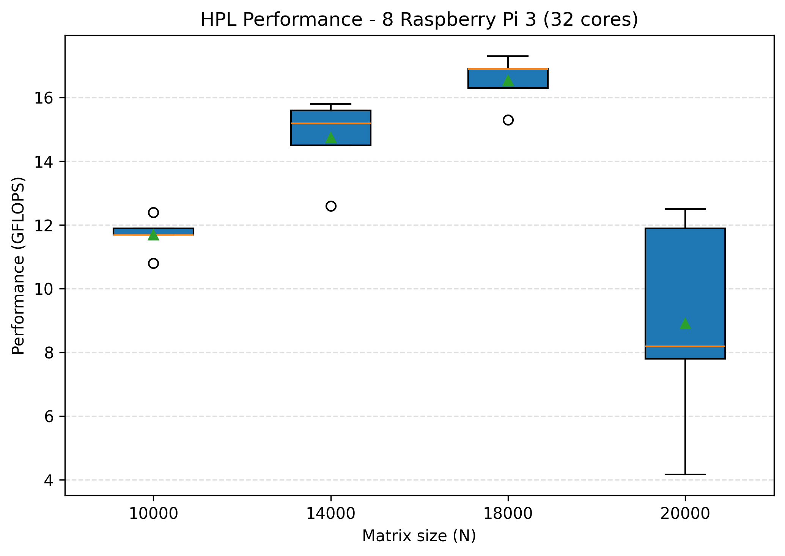
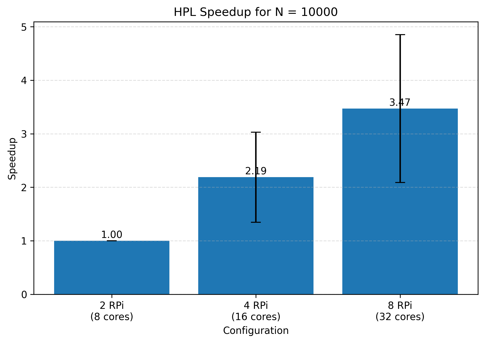

# Investigation of the performance using HPL

## HPL (High Performance Linpack)

**HPL (High Performance Linpack)** is a benchmark used to measure the performance of high-performance computing systems. It solves a random system of linear equations using **LU factorization** and measures how efficiently a computer performs floating-point operations(Gflops).

## Prerequisites and installation
The HPL software package requires an installation of an implementation of the Message Passing Interface(see in task3) and of either the Basic Linear Algebra Subprograms BLAS or the Vector Signal Image Processing Library. For the project BLAS was the one chosen.
- Installation of BLAS and its dependencies:
```bash
sudo apt install -y build-essential gfortran libopenblas-dev
```
- Download HPL:
```bash
git clone https://github.com/benchmark/HPL.git
cd HPL
```
- Unzip the folder and edit the Makefile to build hpl.

## HPL.dat
- HPL.dat is a configuration file where the different parameters can be modified:
    - N, is the size of the linear system A
    - NB, is the size of a block after partiotioning A
    - P and Q, are respectively the number of process rows, columns. 

## Results
- In this project we tested for different values of N depending on the number of nodes: 2, 4, 8.
For each one of these configurations the theoretical maximum value of N was computed: 10000 for 2, 14000 for 4, 20000 for 8. The tests were thus conducted in a way to get closer to those limits to see the behavior: 
    - from 4000 to 10000(2 nodes)
    - from 8000 to 14000(4 nodes)
    - from 10000 to 20000(4 nodes)

- What's expected is that, the greater the N, the better values of Gflops we get until the limit is hit where it should drop.


- As we can observe, the Gflops do get better as the size of the matrix A increases. Although, when we hit the limit, the median is still better than the other ones which is unexpected. The explanation would be that, during the 5 executions at the limit, we got lucky.


- Firstly, the Gflops values are in general better. In fact, now we use 4 nodes so it's expected to reach higher values of Gflops. Secondly, the general behavior is much more expected: increasing until the limit where it drops.


- Lastly, as expected, here we have the best Glfops values yet as we use all 8 worker nodes(peak at 17.3 for N=18000). Moreover, we can once again observe the expected behavior: increasing until the limit where it drops.

- Finally, let's see the speedup that we achieved from 2 worker nodes all the way up to 4 worker nodes.

- As we can observe, the speedup gets better with more workers but never exceed the multiplying factor which is expected because the sequential part such as the allocation of the memory cannot be parallelized which limits the speedup.
