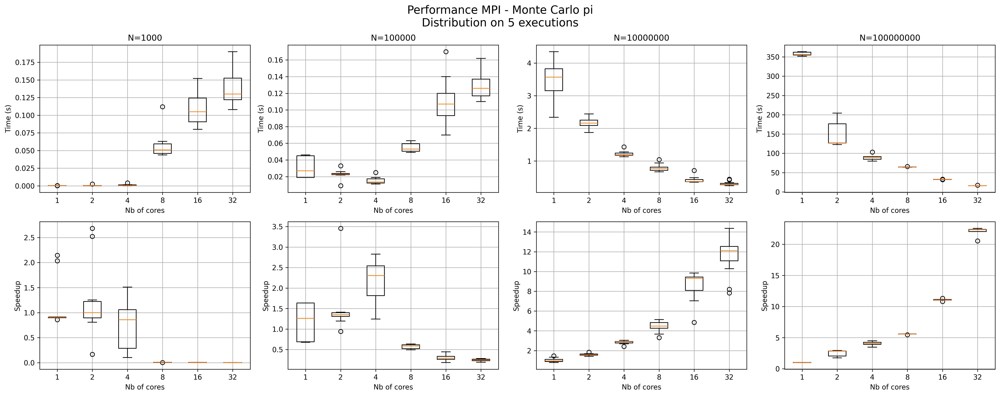
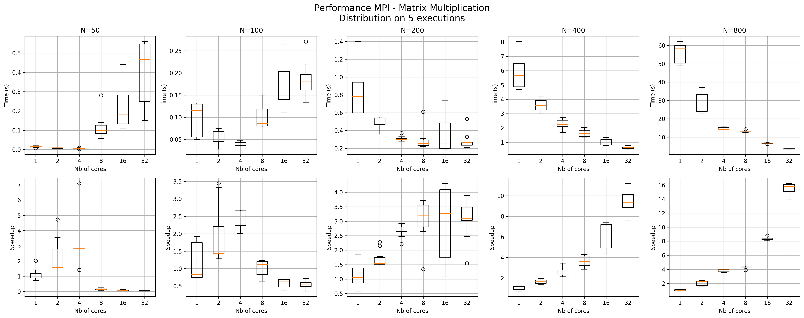

# Prerequisites

Install the required development tools and OpenMPI on each and every Raspberry Pi (Raspberry Pi OS / Debian):

```bash
sudo apt update
sudo apt-get -y install make gcc g++ openmpi-bin openmpi-common libopenmpi-dev
```

Verify the installation:

```bash
gcc --version
make --version
mpicc --version
mpirun --version
```
# Estimation of pi with the Monte Carlo using OpenMPI 
## Description

This example consists of estimating the value of pi with the Monte Carlo method.

The goal is to parallelize the task within a cluster of worker nodes.

Each node generate an equal number of points in the square of size 1, and counts the number of points that is inside of the circumscribed circle. The results are finally gathered to obtain the estimation of pi.

---

## The principle of the Monte Carlo method

Here is work this method works :

We generate random points inside the square \([0,1] \times [0,1]\).

We verify if a point \((x, y)\) belongs to the circle of radius 1 :

x² + y² ≤ 1

The value of pi is then estimated by :

pi ≈ 4 × (points inside the circle / total number of points)

---

## Parallelization with MPI

The program follows the master/worker architecture :

- **Master node**
  - gathers the results from the workers
  - estimates the value of pi

- **Worker nodes**
  - executes a part of the Monte Carlo simulation
  - sends its results to the Master node

---


# Matrix Multiplication using OpenMPI

## Description

This second example consists of computing the product of two matrices A and B.

The goal is to parallelize the computation and store the result into a matrix C.

Each node receives a row of A and allocates memory for a same matrix B containing only ones.

---

## Matrix product (row x matrix interpretation)

The element `C[i,j]` of the matrix `C = A x B` is:

$$
C_{ij} = \sum_{k=0}^{n-1} a_{ik} b_{kj}
$$

---

## Row of C as a product of a row of A with B

The `i`-th row of `C` can be written as:

$$
C_{i,:} = A_{i,:} B
$$

---

## Dot product interpretation

Each element `C[i,j]` is computed as the dot product between a row of `A` and a column of `B`:

$$
C_{ij} =
\begin{bmatrix}
a_{i0} & a_{i1} & ... & a_{i,n-1}
\end{bmatrix}
\begin{bmatrix}
b_{0j} \\
b_{1j} \\
... \\
b_{n-1,j}
\end{bmatrix}
$$

---

## Summary

A row of `C` is obtained by multiplying one row of `A` with the matrix `B`.


## Parallelization with MPI

The program follows the master/worker architecture :

- **Master node**
  - Allocates the memory for A and C, sends each row to a corresponding worker.

- **Worker nodes**
  - Allocates the memory for a matrix B(containing only ones), compute their local row.

# Compilation and execution

## Other files
Executing a mpi program requires the presence of the executable on each and every worker node. Consequently, a way to broadcast the executable to the cluster is to edit a hostfile and a script that connects to each worker node and copy/paste it there:
- hosts.mpi contains all of the IPs of the worker nodes within the cluster.
- copy_test.sh connects to the pi3 via ssh and uses scp to copy/paste the file in the argument.

## Compilation and execution
During this project, the code was fully edited and compiled on the master node(RP5).
-Compilation : 
```bash
mpicc -o MonteCarlopi MonteCarlopi.c
mpicc -o MatrixMulti MatrixMulti.c
```
-Execution : 
```bash
mpirun -np $np --hostfile hosts.mpi MonteCarlopi $N
```
# Automation and Results
## Automation
This section shows how were the execution automated. 
- automating_mpi.sh is a file that runs multiple times a program and prints out the time performances. It needs three arguments: $np the number of cores, $ni the iteration number, $N the size of the problem.
```bash
./automating_mpi.sh $np $ni $N
```
## Monte Carlo Pi

- For N=1 000 and N=100 000, we can see that even though the speed up increases from 1 to 8 proc, it drastically drops at 8 and keeps getting worse until 32 proc. This is because the problem size is too low for an efficient parallelization(Amdahl's law). In fact, from 8 proc and on, the work is not done within one single worker node, thus the communication takes a large proportion of the run-time.
- For N=10 000 000 and N=1 000 000 000, the sequential part is much less important, so the parallelization becomes more efficient. In fact, the more workers the better the speedup gets, matter of fact it peaked at 21 with $np = 32 and N = 1 000 000 000(Gustafson's law).

## Matrix Multiplication

- Same remarks as in the previous example. Amdahl's law from N=50 to N=200. Gustafson's law from N=400 until N=800.
- The values are much more sparse. In fact, in the previous example, the worker cores only send the number of points inside the circumscribed circle to the master node. Whereas in this example, the worker nodes send a complete row after its computation. Thus the communication takes a larger proportion. This leads to a sparser graph and a lower peak of the speedup(16).


