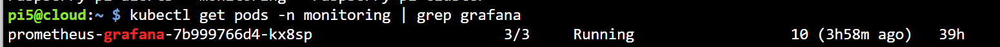
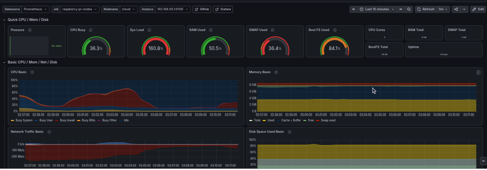

# Grafana Dashboards

> Grafana visualization for the Raspberry Pi edge-monitoring cluster.

**Namespace:** `monitoring`  
**Service:** `prometheus-grafana`  
**Data source:** Prometheus  
**Related documentation:** [Monitoring overview](monitoring.md) · [Prometheus](prometheus.md)

---

## 1. Purpose

Grafana provides a clear visual view of the metrics collected by Prometheus from Pi5, Pi4, and the eight Pi3 workers.

The dashboard helps the team monitor:

- Node availability
- CPU usage
- Memory usage
- Disk usage
- Network traffic
- Raspberry Pi temperature
- System load and uptime

Grafana is useful because Prometheus stores and queries the metrics, while Grafana presents them through dashboards, graphs, gauges, and status panels.

```text
Node Exporter
      ↓
Prometheus
      ↓
Grafana dashboard
```

---

## 2. Grafana deployment in K3s

Grafana is installed as part of `kube-prometheus-stack` and runs inside the K3s `monitoring` namespace.

The main configuration is:

```yaml
grafana:
  enabled: true
  replicas: 1
  service:
    type: NodePort
    port: 80
    targetPort: 3000
    nodePort: 30300
```

K3s manages the Grafana pod and service. If the pod fails, K3s can restart it.

Verify that Grafana is running:

```bash
kubectl get pods -n monitoring | grep grafana
kubectl get svc -n monitoring | grep grafana
```

Expected pod status:

```text
3/3 Running
```




---

## 3. Accessing Grafana

Grafana is exposed through NodePort `30300`.

```text
http://<K3S-NODE-IP>:30300
```

For this deployment:

```text
http://192.168.50.1:30300
```

Retrieve the administrator password:

```bash
kubectl get secret -n monitoring prometheus-grafana   -o jsonpath='{.data.admin-password}'   | base64 -d

echo
```

Username:

```text
admin
```


---

## 4. Dashboard configuration

The **Node Exporter Full** dashboard was used as the main dashboard and configured for the Raspberry Pi monitoring job.

Dashboard settings:

| Setting | Value |
|---|---|
| Dashboard | Node Exporter Full |
| Dashboard ID | `1860` |
| Data source | Prometheus |
| Job | `raspberry-pi-nodes` |
| Instance | All or selected Raspberry Pi |
| Time range | Last 15 minutes |
| Refresh interval | 10 seconds |

The main dashboard panels display:

| Panel | Purpose |
|---|---|
| Node availability | Shows whether each Node Exporter is reachable |
| CPU usage | Shows processor utilization by node |
| Memory usage | Shows memory utilization by node |
| Disk usage | Shows root filesystem usage |
| Network traffic | Shows receive and transmit rates |
| Temperature | Shows Raspberry Pi temperature |
| Load and uptime | Shows workload pressure and running time |

The node availability panel uses:

```promql
up{job="raspberry-pi-nodes"}
```

A value of `1` means the target is reachable. A value of `0` means Prometheus cannot scrape it.

Some panels may show `N/A` when a metric is not supported by a particular Raspberry Pi, operating system, filesystem, or Node Exporter version.

---

## 5. Dashboard verification

The dashboard was verified by:

1. Selecting the `raspberry-pi-nodes` job.
2. Checking Pi5, Pi4, and Pi3 instances.
3. Confirming that the panels refresh automatically.
4. Confirming that reachable nodes show `up = 1`.
5. Comparing selected dashboard values with the same PromQL queries in Prometheus.

The dashboard is considered working when live metrics are visible and new samples appear after each refresh.



---

## 6. Result

Grafana successfully visualizes the Raspberry Pi monitoring data stored in Prometheus. It provides a simple and centralized view of node health, resource usage, network activity, temperature, load, and uptime.

Prometheus remains responsible for collecting and storing the metrics, while Grafana provides the visual monitoring interface.
