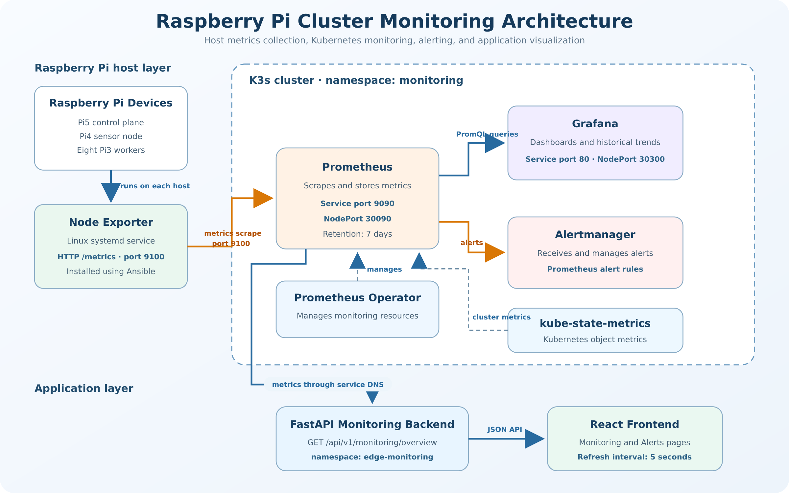
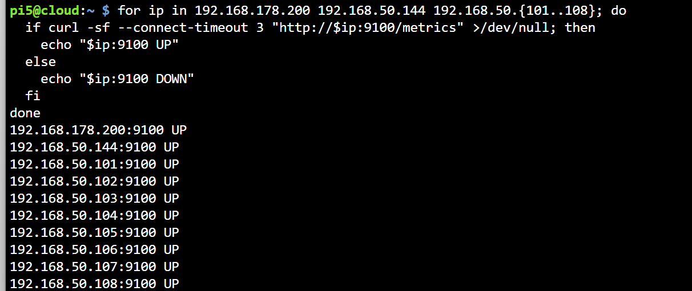
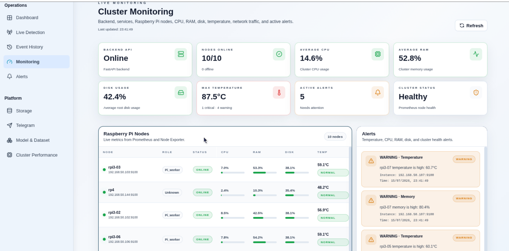
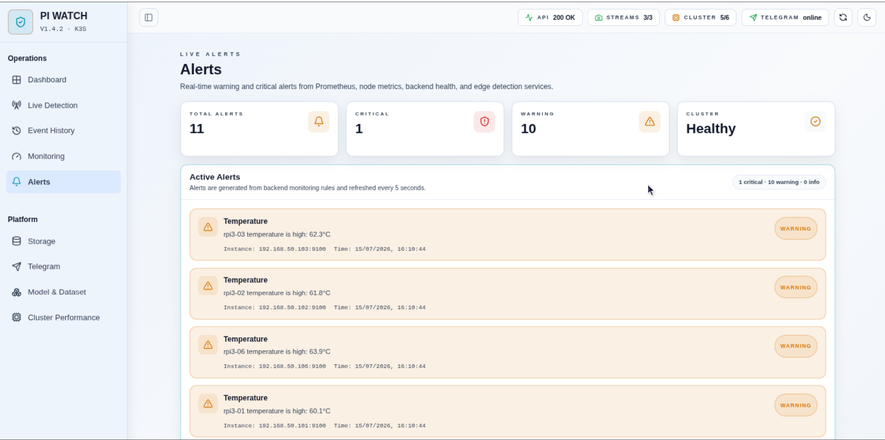

# Raspberry Pi Cluster Monitoring

> System-level documentation for monitoring the Edge-Computing Intrusion Detection System.

**Status:** Completed and verified  
**Platform:** Raspberry Pi 5 control plane, Raspberry Pi 4 sensor node, eight Raspberry Pi 3 workers, and K3s  
**Related documentation:** [Prometheus](prometheus.md) · [Grafana](grafana.md)

---

## 1. Purpose

The monitoring system observes the health and performance of the Raspberry Pi cluster while intrusion detection, image processing, storage, and inference workloads are running. It helps identify:

- Node failures and connectivity loss
- CPU or memory pressure
- Low disk capacity
- High temperature or overheating
- Network bottlenecks
- High system load
- Backend and service failures

The system provides infrastructure-level visualization through Grafana and application-ready monitoring data through the FastAPI backend and React frontend.



---

## 2. Monitoring Components and Responsibilities


| Component | Responsibility |
|---|---|
| Node Exporter | Exposes Linux host metrics on port `9100`. |
| Prometheus | Scrapes, stores, queries, and evaluates time-series metrics. |
| Grafana | Displays current and historical metrics through dashboards. |
| Alertmanager | Manages alerts produced by Prometheus rules. |
| kube-state-metrics | Exposes Kubernetes workload and object metrics. |
| FastAPI | Converts Prometheus data into frontend-ready JSON. |
| React frontend | Displays cluster health, node metrics, and alerts. |

For detailed setup and deployment steps, see [Prometheus](prometheus.md) and [Grafana](grafana.md).

---

## 3. Node Exporter deployment with Ansible

Node Exporter runs directly on each Raspberry Pi as a Linux systemd service and exposes host metrics on port `9100`. Ansible is run from Pi5 to install and configure the exporter consistently on the eight Pi3 workers.

The Kubernetes Node Exporter component remains disabled because the host-level exporters already occupy port `9100`.

### 3.1 Prerequisites

Install Ansible on Pi5:

```bash
sudo apt update
sudo apt install -y ansible
```

Confirm that Ansible is available:

```bash
ansible --version
```

From Pi5, verify SSH access to one Pi3 worker before running the playbook:

```bash
ssh pi3@192.168.50.101
```

Exit the remote session after confirming access:

```bash
exit
```

### 3.2 Create the Ansible inventory

Create `inventory.ini` in the same directory as the playbook:

```ini
[rp3_nodes]
rpi3-01 ansible_host=192.168.50.101
rpi3-02 ansible_host=192.168.50.102
rpi3-03 ansible_host=192.168.50.103
rpi3-04 ansible_host=192.168.50.104
rpi3-05 ansible_host=192.168.50.105
rpi3-06 ansible_host=192.168.50.106
rpi3-07 ansible_host=192.168.50.107
rpi3-08 ansible_host=192.168.50.108

[rp3_nodes:vars]
ansible_user=pi
ansible_python_interpreter=/usr/bin/python3
```

Confirm that Ansible can parse the inventory:

```bash
ansible-inventory -i inventory.ini --graph
```

The output must contain the `rp3_nodes` group and all eight Pi3 hosts. If Ansible reports `No inventory was parsed` or `no hosts matched`, stop and correct the inventory path before continuing.

Test connectivity without changing the nodes:

```bash
ansible rp3_nodes -i inventory.ini -m ping --ask-pass
```

Each node should return `SUCCESS` and `ping: pong`.

### 3.3 Create the Node Exporter playbook

Create `install-node-exporter.yml` beside `inventory.ini`:

```yaml
---
- name: Install Prometheus Node Exporter on all RP3 nodes
  hosts: rp3_nodes
  become: true
  gather_facts: true

  tasks:
    - name: Update apt package cache
      ansible.builtin.apt:
        update_cache: true
        cache_valid_time: 3600

    - name: Install Prometheus Node Exporter
      ansible.builtin.apt:
        name: prometheus-node-exporter
        state: present

    - name: Enable and start Prometheus Node Exporter
      ansible.builtin.systemd:
        name: prometheus-node-exporter
        enabled: true
        state: started
```

The playbook:

1. Updates the apt package cache when required.
2. Installs the `prometheus-node-exporter` package.
3. Enables the `prometheus-node-exporter` service at boot.
4. Starts the service if it is not already running.

Validate the playbook syntax without changing any node:

```bash
ansible-playbook -i inventory.ini \
  install-node-exporter.yml \
  --syntax-check
```

### 3.4 Deploy Node Exporter on new or unconfigured Pi3 nodes

Only run this command when deployment or repair is actually required:

```bash
ansible-playbook -i inventory.ini install-node-exporter.yml \
  --ask-pass \
  --ask-become-pass
```

After deployment, confirm the service on a Pi3 worker:

```bash
ssh pi3@192.168.50.101 \
  "systemctl is-enabled prometheus-node-exporter && systemctl is-active prometheus-node-exporter"
```

Expected output:

```text
enabled
active
```

The correct Debian service name is `prometheus-node-exporter`. A command such as `systemctl status node_exporter` may report that the unit does not exist.

### 3.5 Verify the existing exporters safely

The following commands are read-only and do not restart, reinstall, or modify the working exporters.

Test one Pi3:

```bash
curl -s http://192.168.50.101:9100/metrics | head
```

Test Pi4:

```bash
curl -s http://192.168.50.144:9100/metrics | head
```

Test Pi5 locally:

```bash
sudo ss -lntp | grep ':9100'
curl -s http://127.0.0.1:9100/metrics | head
```

Test Pi5, Pi4, and all eight Pi3 workers together:

```bash
for ip in 192.168.50.1 192.168.50.144 192.168.50.{101..108}; do
  if curl -sf --connect-timeout 3 "http://$ip:9100/metrics" >/dev/null; then
    echo "$ip:9100 UP"
  else
    echo "$ip:9100 DOWN"
  fi
done
```

All ten addresses should report `UP`.

The final monitoring addresses are:

| Device | Node Exporter address |
|---|---|
| Pi5 control plane | `192.168.50.1:9100` |
| Pi4 sensor node | `192.168.50.144:9100` |
| Pi3-01 to Pi3-08 | `192.168.50.101:9100` to `192.168.50.108:9100` |

Only `192.168.50.1:9100` is used for Pi5 so the same device is not counted twice through another network address.

The following screenshot may be used as read-only availability evidence. Crop out any failed Ansible attempt and retain only the command and ten `UP` results.




---

## 4. Prometheus collection and monitoring flow

After Node Exporter was verified on Pi5, Pi4, and the eight Pi3 workers, Prometheus was configured to scrape the metrics exposed on port `9100`.

Prometheus runs inside the K3s `monitoring` namespace and collects metrics from all Raspberry Pi hosts every 15 seconds. It stores the data as time-series metrics, supports PromQL queries, and evaluates alert rules.

The FastAPI backend does not query Node Exporter directly. Instead, it queries Prometheus through the internal Kubernetes service:

```text
http://prometheus-kube-prometheus-prometheus.monitoring.svc.cluster.local:9090
## 5. FastAPI monitoring integration

The FastAPI backend queries Prometheus and returns normalized data for the frontend.

```http
GET /api/v1/monitoring/overview
```

The endpoint returns:

- Backend status
- YOLO and Telegram service status
- Total, online, offline, and degraded nodes
- Per-node CPU, memory, disk, and temperature data
- Temperature health status
- Network receive and transmit rates
- Load averages and uptime
- Disk capacity information
- Active alerts
- Prometheus query errors

The backend deployment is named `backend` in namespace `edge-monitoring`.

```bash
kubectl set env deployment/backend \
  -n edge-monitoring \
  PROMETHEUS_URL=http://prometheus-kube-prometheus-prometheus.monitoring.svc.cluster.local:9090
```

Verify the deployment and configuration:

```bash
kubectl rollout status deployment/backend \
  -n edge-monitoring \
  --timeout=5m

kubectl exec -n edge-monitoring deployment/backend -- \
  printenv PROMETHEUS_URL
```

Test Prometheus connectivity from the backend:

```bash
kubectl exec -n edge-monitoring deployment/backend -- \
  python -c "import urllib.request; print(urllib.request.urlopen('http://prometheus-kube-prometheus-prometheus.monitoring.svc.cluster.local:9090/-/ready').read().decode())"
```

Test the monitoring endpoint:

```bash
kubectl exec -n edge-monitoring deployment/backend -- \
  python -c "import urllib.request; print(urllib.request.urlopen('http://127.0.0.1:8000/api/v1/monitoring/overview').read().decode())"
```

Temporary local service access:

```bash
kubectl port-forward -n edge-monitoring service/backend 8001:8000
```

In another terminal:

```bash
curl -i http://127.0.0.1:8001/api/v1/monitoring/overview
```

Expected result:

```text
HTTP/1.1 200 OK
```

> **IMAGE PLACEHOLDER — Monitoring API**  
> Suggested file: `images/monitoring/monitoring-api-response.png`  
> Add a successful JSON response from `/api/v1/monitoring/overview`.

---

## 6. Backend health thresholds

| Resource | Warning | Critical |
|---|---:|---:|
| Temperature | 60°C | 70°C |
| CPU | 80% | 90% |
| Memory | 80% | 90% |
| Disk | 80% | 90% |

Application-level alerts include:

- Node offline
- High CPU usage
- High memory usage
- High disk usage
- High temperature
- Critical temperature

---

## 7. React frontend integration

The React frontend calls the monitoring endpoint every five seconds. A manual refresh button executes the same request immediately.

The interface displays:

- Backend and Prometheus status
- YOLO and Telegram service status
- Online and total node counts
- Average CPU and memory utilization
- Disk utilization
- Maximum temperature and temperature health
- Active alerts and cluster status
- Per-node CPU, memory, disk, temperature, network, load, uptime, and health information

Verification:

1. Open the Monitoring page.
2. Open browser developer tools.
3. Select the **Network** tab.
4. Find `/api/v1/monitoring/overview`.
5. Confirm HTTP `200`.
6. Confirm automatic refresh and the manual refresh button.




---


## 8. Result

The monitoring implementation is complete. Node Exporter exposes system metrics from Pi5, Pi4, and the eight Pi3 workers. Prometheus collects the metrics inside K3s, Grafana visualizes live and historical data, Alertmanager manages health alerts, and the FastAPI backend supplies normalized monitoring information to the React frontend.
