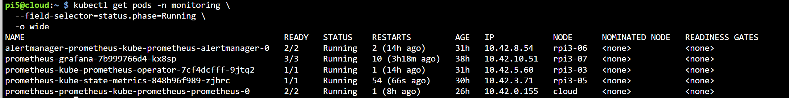
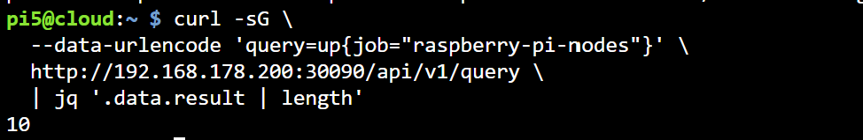

# Prometheus Deployment and Configuration

**Namespace:** `monitoring`  
**Helm release:** `prometheus`  
**Chart:** `prometheus-community/kube-prometheus-stack`  
**External port:** `30090`  
**Related documentation:** [Monitoring overview](monitoring.md) · [Grafana](grafana.md)

---

## 1. Phase 1: Host Node Exporters and local Prometheus

The monitoring system was first validated directly on Pi5 before Prometheus was migrated into K3s. Node Exporter ran as a Linux service on every Raspberry Pi, while Prometheus and Alertmanager ran locally on Pi5.

### 1.1 Install Node Exporter on the Raspberry Pi hosts

Node Exporter was installed on the Pi3 workers using Ansible. The complete inventory and playbook are documented in [Monitoring overview](monitoring.md). On an individual Debian-based Raspberry Pi, the equivalent package installation is:

```bash
sudo apt update
sudo apt install -y prometheus-node-exporter
sudo systemctl enable --now prometheus-node-exporter
```

Verify the correct systemd service:

```bash
systemctl is-enabled prometheus-node-exporter
systemctl is-active prometheus-node-exporter
```

Expected output:

```text
enabled
active
```

The Debian service is named `prometheus-node-exporter`. Therefore, `systemctl status node_exporter` may return `Unit node_exporter.service could not be found` even when the exporter is installed correctly.

Confirm that it listens on port `9100` and exposes metrics:

```bash
sudo ss -lntp | grep ':9100'
curl -s http://127.0.0.1:9100/metrics | head
```

### 1.2 Verify all host exporters from Pi5

Run this read-only check from Pi5:

```bash
for ip in 192.168.178.200 192.168.50.144 192.168.50.{101..108}; do
  if curl -sf --connect-timeout 3 "http://$ip:9100/metrics" >/dev/null; then
    echo "$ip:9100 UP"
  else
    echo "$ip:9100 DOWN"
  fi
done
```

Expected: ten `UP` entries for Pi5, Pi4, and the eight Pi3 workers.

### 1.3 Install Prometheus and Alertmanager locally on Pi5

Install the Debian packages:

```bash
sudo apt update
sudo apt install -y prometheus prometheus-alertmanager
```

Confirm the installed tools:

```bash
prometheus --version
promtool --version
prometheus-alertmanager --version
```

Back up the default Prometheus configuration before changing it:

```bash
sudo cp /etc/prometheus/prometheus.yml \
  /etc/prometheus/prometheus.yml.backup
```

### 1.4 Configure local Prometheus scraping

Edit `/etc/prometheus/prometheus.yml` so that it contains the following global settings, alert configuration, rule-file location, and Raspberry Pi targets:

```yaml
global:
  scrape_interval: 15s
  evaluation_interval: 15s

alerting:
  alertmanagers:
    - static_configs:
        - targets:
            - 127.0.0.1:9093

rule_files:
  - /etc/prometheus/rules/*.yml

scrape_configs:
  - job_name: prometheus
    static_configs:
      - targets:
          - 127.0.0.1:9090

  - job_name: raspberry-pi-nodes
    scrape_interval: 15s
    scrape_timeout: 10s
    static_configs:
      - targets:
          - 192.168.178.200:9100
          - 192.168.50.144:9100
          - 192.168.50.101:9100
          - 192.168.50.102:9100
          - 192.168.50.103:9100
          - 192.168.50.104:9100
          - 192.168.50.105:9100
          - 192.168.50.106:9100
          - 192.168.50.107:9100
          - 192.168.50.108:9100
```

Create the local rule directory:

```bash
sudo install -d -o prometheus -g prometheus \
  /etc/prometheus/rules
```

Validate the configuration before starting Prometheus:

```bash
sudo promtool check config /etc/prometheus/prometheus.yml
```

Expected result:

```text
SUCCESS: /etc/prometheus/prometheus.yml is valid prometheus config file syntax
```

### 1.5 Configure local alert rules

Create `/etc/prometheus/rules/raspberry-pi-alerts.yml`:

```yaml
groups:
  - name: raspberry-pi-cluster
    rules:
      - alert: RaspberryPiNodeDown
        expr: up{job="raspberry-pi-nodes"} == 0
        for: 1m
        labels:
          severity: critical
        annotations:
          summary: Raspberry Pi node is down
          description: "{{ $labels.instance }} has been unreachable for one minute."

      - alert: RaspberryPiHighCPU
        expr: |
          100 - (
            avg by(instance) (
              rate(node_cpu_seconds_total{
                job="raspberry-pi-nodes",
                mode="idle"
              }[5m])
            ) * 100
          ) > 85
        for: 3m
        labels:
          severity: warning
        annotations:
          summary: High CPU usage
          description: "{{ $labels.instance }} CPU usage is above 85%."

      - alert: RaspberryPiHighMemory
        expr: |
          100 * (
            1 - (
              node_memory_MemAvailable_bytes{job="raspberry-pi-nodes"}
              /
              node_memory_MemTotal_bytes{job="raspberry-pi-nodes"}
            )
          ) > 85
        for: 3m
        labels:
          severity: warning
        annotations:
          summary: High memory usage
          description: "{{ $labels.instance }} memory usage is above 85%."
```

Set ownership and validate the rule file:

```bash
sudo chown prometheus:prometheus \
  /etc/prometheus/rules/raspberry-pi-alerts.yml

sudo promtool check rules \
  /etc/prometheus/rules/raspberry-pi-alerts.yml
```

Expected result:

```text
SUCCESS: 3 rules found
```

The Kubernetes section later in this guide extends the rules with disk and temperature alerts.

### 1.6 Start the local monitoring services

Enable and start Alertmanager and Prometheus:

```bash
sudo systemctl enable --now prometheus-alertmanager
sudo systemctl enable --now prometheus
```

Verify both services:

```bash
systemctl is-active prometheus
systemctl is-active prometheus-alertmanager
```

Expected:

```text
active
active
```

Check their readiness endpoints:

```bash
curl -fsS http://127.0.0.1:9090/-/ready
curl -fsS http://127.0.0.1:9093/-/ready
```

Prometheus should return:

```text
Prometheus Server is Ready.
```

### 1.7 Verify local targets and run PromQL queries

Open Prometheus locally on Pi5:

```text
http://127.0.0.1:9090
```

For access from another computer without exposing Prometheus publicly, create an SSH tunnel:

```bash
ssh -L 9090:127.0.0.1:9090 pi5@192.168.178.200
```

Then open `http://127.0.0.1:9090` on that computer.

Open the Targets page and confirm that all Raspberry Pi targets are `UP`:

```text
http://127.0.0.1:9090/targets
```

Run the node-availability query in the Prometheus Query page:

```promql
up{job="raspberry-pi-nodes"}
```

Run a concise query through the local HTTP API:

```bash
curl -sG \
  --data-urlencode 'query=count(up{job="raspberry-pi-nodes"} == 1)' \
  http://127.0.0.1:9090/api/v1/query \
  | jq -r '"Online Raspberry Pi targets: \(.data.result[0].value[1])"'
```

Expected:

```text
Online Raspberry Pi targets: 10
```

Additional PromQL queries for CPU, memory, disk, network, and temperature are provided in Section 7.

### 1.8 Verify local alert rules and a controlled firing alert

Check that Prometheus loaded the Raspberry Pi rules:

```bash
curl -s http://127.0.0.1:9090/api/v1/rules \
  | grep -oE 'RaspberryPi[A-Za-z]+' \
  | sort -u
```

Open the local rules and alerts pages:

```text
http://127.0.0.1:9090/rules
http://127.0.0.1:9090/alerts
```

To prove the alert pipeline without disconnecting a Raspberry Pi, use a temporary test rule only during initial setup. Create `/etc/prometheus/rules/documentation-test.yml`:

```yaml
groups:
  - name: documentation-test
    rules:
      - alert: PrometheusDocumentationTest
        expr: vector(1)
        for: 30s
        labels:
          severity: warning
        annotations:
          summary: Controlled Prometheus alert test
```

Validate the rule and restart local Prometheus during the initial setup window:

```bash
sudo promtool check rules \
  /etc/prometheus/rules/documentation-test.yml

sudo systemctl restart prometheus
```

After approximately 30 seconds, confirm the alert state:

```bash
curl -s http://127.0.0.1:9090/api/v1/alerts \
  | jq -r '.data.alerts[] | "\(.labels.alertname) = \(.state)"'
```

Expected:

```text
PrometheusDocumentationTest = firing
```

After collecting the initial evidence, remove the temporary rule and restart Prometheus:

```bash
sudo rm /etc/prometheus/rules/documentation-test.yml
sudo systemctl restart prometheus
```

Do not run this temporary local test against the current K3s deployment. Kubernetes alert verification is documented in Section 8.

### 1.9 Why Prometheus was migrated to K3s

The local Prometheus installation proved that the exporters, queries, and alerts worked. However, a Kubernetes backend cannot use `127.0.0.1:9090` to reach Prometheus on Pi5 because loopback inside a pod refers to that pod. Deploying Prometheus inside K3s provides stable Kubernetes service discovery and integrates it with Grafana, Alertmanager, and the FastAPI backend.

The final K3s architecture uses:

| Purpose | Address or port |
|---|---|
| Host Node Exporters | `<node-ip>:9100` |
| Prometheus Kubernetes service | port `9090` |
| Prometheus external access | NodePort `30090` |
| Grafana external access | NodePort `30300` |

### 1.10 Prevent the Node Exporter port conflict

`kube-prometheus-stack` normally deploys a Node Exporter DaemonSet. Because the systemd exporters already use host port `9100`, the Kubernetes exporter pods previously failed with:

```text
listen tcp 0.0.0.0:9100: bind: address already in use
```

The final design retains the working host exporters and disables the chart component:

```yaml
nodeExporter:
  enabled: false
```

Do not change the working exporters to another port. The K3s Prometheus deployment scrapes their existing port `9100`.

Before the first K3s deployment, confirm that NodePorts `30090` and `30300` are not assigned to another service:

```bash
kubectl get svc -A \
  -o custom-columns='NAMESPACE:.metadata.namespace,NAME:.metadata.name,NODEPORTS:.spec.ports[*].nodePort' \
  | grep -E '30090|30300' || true
```

---

## 2. K3s and tooling prerequisites

Run the following commands from Pi5. Confirm that the K3s cluster is reachable and that Helm and kubectl are installed:

```bash
kubectl get nodes -o wide
helm version
kubectl version --client
```

The Pi5 control plane and required Pi3 workers should report `Ready`. Pi4 does not need to appear as a Kubernetes node because it is monitored through its host Node Exporter endpoint.

Confirm that the Raspberry Pi Node Exporters respond before installing Prometheus:

```bash
for ip in 192.168.178.200 192.168.50.144 192.168.50.{101..108}; do
  if curl -sf --connect-timeout 3 "http://$ip:9100/metrics" >/dev/null; then
    echo "$ip:9100 UP"
  else
    echo "$ip:9100 DOWN"
  fi
done
```

All ten addresses must report `UP` before Prometheus is configured to scrape them. This command performs read-only HTTP requests and does not modify the exporters.

---

## 3. Add the Helm repository

```bash
helm repo add prometheus-community \
  https://prometheus-community.github.io/helm-charts

helm repo update
```

Verify that the chart is available:

```bash
helm search repo prometheus-community/kube-prometheus-stack
```

---

## 4. Helm values

Create `prometheus-k3s-values.yaml` in the working directory:

```yaml
nodeExporter:
  enabled: false

prometheus:
  service:
    type: NodePort
    port: 9090
    targetPort: 9090
    nodePort: 30090

  prometheusSpec:
    retention: 7d

    resources:
      requests:
        memory: 300Mi
        cpu: 100m
      limits:
        memory: 1Gi
        cpu: 1000m

    additionalScrapeConfigs:
      - job_name: raspberry-pi-nodes
        scrape_interval: 15s
        scrape_timeout: 10s
        static_configs:
          - targets:
              - 192.168.178.200:9100
              - 192.168.50.144:9100
              - 192.168.50.101:9100
              - 192.168.50.102:9100
              - 192.168.50.103:9100
              - 192.168.50.104:9100
              - 192.168.50.105:9100
              - 192.168.50.106:9100
              - 192.168.50.107:9100
              - 192.168.50.108:9100

grafana:
  enabled: true
  replicas: 1
  service:
    type: NodePort
    port: 80
    targetPort: 3000
    nodePort: 30300

alertmanager:
  enabled: true

kube-state-metrics:
  enabled: true
```

`nodeExporter.enabled` is set to `false` because Node Exporter already runs directly on each Raspberry Pi host.

The configuration also:

- exposes Prometheus through NodePort `30090`;
- exposes Grafana through NodePort `30300`;
- retains Prometheus metrics for seven days;
- scrapes Pi5, Pi4, and eight Pi3 exporters every 15 seconds;
- enables Alertmanager and kube-state-metrics.

---

## 5. Validate and install

Validate the generated Kubernetes resources without modifying the cluster:

```bash
helm template prometheus \
  prometheus-community/kube-prometheus-stack \
  -n monitoring \
  -f prometheus-k3s-values.yaml >/dev/null \
  && echo "Helm configuration validation: PASS"
```

Expected output:

```text
Helm configuration validation: PASS
```

Install or update the monitoring stack:

```bash
helm upgrade --install prometheus \
  prometheus-community/kube-prometheus-stack \
  --namespace monitoring \
  --create-namespace \
  -f prometheus-k3s-values.yaml \
  --set nodeExporter.enabled=false \
  --wait \
  --timeout 30m
```

`helm upgrade --install` installs the release when it does not exist and updates the same release when it already exists.

---

## 6. Verify the deployment

Verify the Helm release:

```bash
helm list -n monitoring
helm status prometheus -n monitoring
```

Display only running monitoring pods for a clean terminal result:

```bash
kubectl get pods -n monitoring \
  --field-selector=status.phase=Running \
  -o wide
```

Verify the services and their ports:

```bash
kubectl get svc -n monitoring \
  -o custom-columns='NAME:.metadata.name,TYPE:.spec.type,PORTS:.spec.ports[*].port,NODEPORTS:.spec.ports[*].nodePort'
```

Confirm that no Kubernetes Node Exporter DaemonSet was created:

```bash
kubectl get daemonset -n monitoring
```

Expected states:

| Component | Expected state |
|---|---|
| Prometheus | `2/2 Running` |
| Alertmanager | `2/2 Running` |
| Prometheus Operator | `1/1 Running` |
| kube-state-metrics | `1/1 Running` |
| Grafana | `3/3 Running` |
| Kubernetes Node Exporter | No DaemonSet; host exporters are used. |

Test readiness:

```bash
curl -s http://192.168.178.200:30090/-/ready
```

Expected:

```text
Prometheus Server is Ready.
```

Produce a short readiness result suitable for documentation:

```bash
printf 'Prometheus readiness: '
curl -fsS http://192.168.178.200:30090/-/ready
```

Access pages:

| Page | URL |
|---|---|
| Prometheus | `http://192.168.178.200:30090` |
| Targets | `http://192.168.178.200:30090/targets` |
| Rules | `http://192.168.178.200:30090/rules` |
| Alerts | `http://192.168.178.200:30090/alerts` |





The targets screenshot must show all ten `raspberry-pi-nodes` endpoints in the `UP` state. Zoom out or capture a second view if all rows do not fit in one screenshot.

---

## 7. PromQL queries

### Node availability

```promql
up{job="raspberry-pi-nodes"}
```

### CPU usage

```promql
100 - (
  avg by(instance) (
    rate(node_cpu_seconds_total{
      job="raspberry-pi-nodes",
      mode="idle"
    }[2m])
  ) * 100
)
```

### Memory usage

```promql
100 * (
  1 - (
    node_memory_MemAvailable_bytes{job="raspberry-pi-nodes"}
    /
    node_memory_MemTotal_bytes{job="raspberry-pi-nodes"}
  )
)
```

### Disk usage

```promql
100 * (
  1 - (
    node_filesystem_avail_bytes{
      job="raspberry-pi-nodes",
      mountpoint="/",
      fstype!~"tmpfs|overlay|squashfs"
    }
    /
    node_filesystem_size_bytes{
      job="raspberry-pi-nodes",
      mountpoint="/",
      fstype!~"tmpfs|overlay|squashfs"
    }
  )
)
```

### Temperature

```promql
max by(instance) (
  node_hwmon_temp_celsius{job="raspberry-pi-nodes"}
)
```

Alternative metric:

```promql
max by(instance) (
  node_thermal_zone_temp{job="raspberry-pi-nodes"}
)
```

### Network receive

```promql
sum by(instance) (
  rate(node_network_receive_bytes_total{
    job="raspberry-pi-nodes",
    device!~"lo|veth.*|docker.*|cni.*|flannel.*"
  }[2m])
)
```

### Network transmit

```promql
sum by(instance) (
  rate(node_network_transmit_bytes_total{
    job="raspberry-pi-nodes",
    device!~"lo|veth.*|docker.*|cni.*|flannel.*"
  }[2m])
)
```

---

## 8. Alert rules

Store the following resource at `k8s/monitoring/raspberry-pi-alerts.yaml`:

```yaml
apiVersion: monitoring.coreos.com/v1
kind: PrometheusRule
metadata:
  name: raspberry-pi-alerts
  namespace: monitoring
  labels:
    release: prometheus
spec:
  groups:
    - name: raspberry-pi-cluster
      rules:
        - alert: RaspberryPiNodeDown
          expr: up{job="raspberry-pi-nodes"} == 0
          for: 1m
          labels:
            severity: critical
          annotations:
            summary: Raspberry Pi node is down
            description: >-
              {{ $labels.instance }} has been unreachable for more than one minute.

        - alert: RaspberryPiHighCPU
          expr: |
            100 - (
              avg by(instance) (
                rate(node_cpu_seconds_total{
                  job="raspberry-pi-nodes",
                  mode="idle"
                }[5m])
              ) * 100
            ) > 85
          for: 3m
          labels:
            severity: warning
          annotations:
            summary: High CPU usage
            description: >-
              {{ $labels.instance }} CPU usage has exceeded 85%.

        - alert: RaspberryPiHighMemory
          expr: |
            100 * (
              1 - (
                node_memory_MemAvailable_bytes{job="raspberry-pi-nodes"}
                /
                node_memory_MemTotal_bytes{job="raspberry-pi-nodes"}
              )
            ) > 85
          for: 3m
          labels:
            severity: warning
          annotations:
            summary: High memory usage
            description: >-
              {{ $labels.instance }} memory usage has exceeded 85%.

        - alert: RaspberryPiHighDisk
          expr: |
            100 * (
              1 - (
                node_filesystem_avail_bytes{
                  job="raspberry-pi-nodes",
                  mountpoint="/",
                  fstype!~"tmpfs|overlay|squashfs"
                }
                /
                node_filesystem_size_bytes{
                  job="raspberry-pi-nodes",
                  mountpoint="/",
                  fstype!~"tmpfs|overlay|squashfs"
                }
              )
            ) > 80
          for: 5m
          labels:
            severity: warning
          annotations:
            summary: High disk usage
            description: >-
              {{ $labels.instance }} root disk usage has exceeded 80%.

        - alert: RaspberryPiHighTemperature
          expr: |
            max by(instance) (
              node_hwmon_temp_celsius{job="raspberry-pi-nodes"}
            ) > 60
          for: 2m
          labels:
            severity: warning
          annotations:
            summary: High Raspberry Pi temperature
            description: >-
              {{ $labels.instance }} temperature is above 60°C.

        - alert: RaspberryPiCriticalTemperature
          expr: |
            max by(instance) (
              node_hwmon_temp_celsius{job="raspberry-pi-nodes"}
            ) > 70
          for: 1m
          labels:
            severity: critical
          annotations:
            summary: Critical Raspberry Pi temperature
            description: >-
              {{ $labels.instance }} temperature is above 70°C.
```

If the nodes expose `node_thermal_zone_temp` instead, use that metric in the two temperature rules.

Apply and verify:

```bash
kubectl apply --dry-run=server \
  -f k8s/monitoring/raspberry-pi-alerts.yaml

kubectl apply \
  -f k8s/monitoring/raspberry-pi-alerts.yaml

kubectl get prometheusrule -n monitoring

kubectl describe prometheusrule raspberry-pi-alerts \
  -n monitoring
```

Produce a concise Kubernetes result:

```bash
kubectl get prometheusrule raspberry-pi-alerts \
  -n monitoring \
  -o custom-columns='NAME:.metadata.name,NAMESPACE:.metadata.namespace,GROUPS:.spec.groups[*].name'
```

Verify through the Prometheus API:

```bash
curl -s http://192.168.178.200:30090/api/v1/rules \
  | grep -oE 'RaspberryPi[A-Za-z]+' \
  | sort -u
```


The screenshot is valid evidence that the `raspberry-pi-cluster` rule group loaded successfully and that all displayed rules were evaluated with status `OK`. The temperature-rule names include the `Hwmon` suffix in the running configuration; this naming difference does not change their purpose.

Screenshots of a firing node-down alert or Alertmanager notification are optional. Do not stop a working node solely to create documentation evidence. The loaded-rules screenshot is sufficient to demonstrate the alert-rule configuration.

---

## 9. Backend service discovery

Kubernetes workloads access Prometheus through its internal service:

```text
http://prometheus-kube-prometheus-prometheus.monitoring.svc.cluster.local:9090
```

```bash
kubectl set env deployment/backend \
  -n edge-monitoring \
  PROMETHEUS_URL=http://prometheus-kube-prometheus-prometheus.monitoring.svc.cluster.local:9090
```

Wait for the backend rollout and confirm its configured URL:

```bash
kubectl rollout status deployment/backend \
  -n edge-monitoring \
  --timeout=5m

kubectl exec -n edge-monitoring deployment/backend -- \
  printenv PROMETHEUS_URL
```

Expected URL:

```text
http://prometheus-kube-prometheus-prometheus.monitoring.svc.cluster.local:9090
```

Verify Prometheus readiness from inside the backend pod:

```bash
kubectl exec -n edge-monitoring deployment/backend -- \
  python -c "import urllib.request; print(urllib.request.urlopen('http://prometheus-kube-prometheus-prometheus.monitoring.svc.cluster.local:9090/-/ready').read().decode())"
```

Expected output:

```text
Prometheus Server is Ready.
```

---

## 10. Deployment evidence

The document uses three screenshots as final deployment evidence:

| Evidence | Repository path |
|---|---|
| Monitoring components running in K3s | `images/prometheus-pods-healthy.png` |
| Raspberry Pi scrape targets reporting `UP` | `images/prometheus-targets.png` |
| Raspberry Pi alert rules loaded with status `OK` | `images/raspberry-pi-alert-rules.png` |

The local installation is documented through commands and expected outputs, so additional local Prometheus screenshots are not required.

## 11. Result

The monitoring pipeline was first proven locally on Pi5 by installing Prometheus and Alertmanager, scraping all ten host Node Exporters, executing PromQL queries, and validating a controlled firing alert. Prometheus was then migrated to `kube-prometheus-stack` in the K3s `monitoring` namespace. The final deployment stores seven days of metrics, evaluates the Raspberry Pi alert rules, supplies Grafana dashboards, and provides monitoring data to the FastAPI backend through Kubernetes service discovery.
