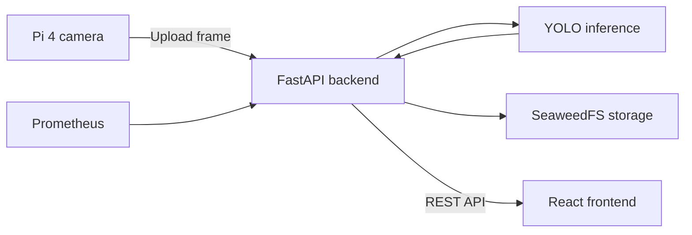

# Frontend – PIWATCH

> Web interface for the Real-Time Edge-AI Surveillance and Threat Detection system.

**Task:** Task 8 – Frontend Development  
**Framework:** React, TypeScript and Vite  
**Communication:** REST API  
**Backend:** FastAPI  
**Target platform:** Docker and K3s on the Raspberry Pi cluster

---

## 1. Overview

PIWATCH is the user-facing monitoring and surveillance interface for the Raspberry Pi edge-computing intrusion-detection system. It combines threat-detection evidence, event records, model information and infrastructure health data in one responsive web application.

The frontend receives data from the FastAPI backend rather than communicating directly with the camera, YOLO model, Prometheus or SeaweedFS. This keeps the interface independent of the internal storage and monitoring implementation.

The application provides:

- a system overview dashboard;
- live and recent detection information;
- event history with timestamps and detection evidence;
- raw and annotated image viewing;
- Raspberry Pi cluster monitoring;
- infrastructure and threat alerts;
- model and dataset information;
- cluster-performance information;
- responsive navigation and light/dark themes.

<!-- SCREENSHOT: Complete PIWATCH dashboard in dark theme -->


*Figure 1: Main PIWATCH dashboard presenting detection and system information.*

---

## 2. Role in the System

The end-to-end data flow is:

1. The Raspberry Pi 4 camera node captures an image.
2. The camera sender uploads the frame to the FastAPI backend.
3. The backend validates the request and coordinates image storage and inference.
4. YOLO processes the image and produces detection results and annotated evidence.
5. Images are stored in the `captured-images` SeaweedFS bucket, while metadata is stored persistently by the backend.
6. Prometheus collects health and performance metrics from the Raspberry Pi nodes.
7. The React frontend requests events, images, model details and monitoring information through REST endpoints.



The camera upload contract remains:

```http
POST /api/v1/frames
Content-Type: multipart/form-data
```

Multipart fields:

| Field | Purpose |
| --- | --- |
| `image` | Captured JPEG image |
| `sensor_node_id` | Identifier of the camera node |
| `captured_at` | Capture timestamp |
| `sequence_number` | Frame sequence number |
| `camera_location` | Human-readable camera location |

The upload endpoint is used by the Pi 4 sender, not directly by the browser.

---

## 3. Technology Stack

| Technology | Purpose |
| --- | --- |
| React | Component-based user interface |
| TypeScript | Type-safe frontend development |
| Vite | Development server and production build tooling |
| React Router | Client-side page navigation |
| Lucide React | Interface icons |
| CSS custom properties | Centralised colours and light/dark themes |
| Fetch/REST client | Communication with the FastAPI backend |
| Docker | Reproducible frontend container |
| K3s | Cluster deployment and service management |

---

## 4. Frontend Project Structure

The frontend follows a feature-based structure. Shared application configuration, layouts and API communication are separated from page-specific components and styles.

```text
frontend/
├── .env.example
├── index.html
├── package.json
├── package-lock.json
├── tsconfig.json
├── vite.config.ts
│
├── src/
│   ├── main.tsx
│   │
│   ├── styles/
│   │   ├── theme.css
│   │   ├── global.css
│   │   └── index.css
│   │
│   ├── app/
│   │   ├── App.tsx
│   │   └── App.css
│   │
│   ├── services/
│   │   └── api.ts
│   │
│   ├── components/
│   │   └── layout/
│   │       ├── Sidebar.tsx
│   │       ├── Sidebar.css
│   │       ├── Topbar.tsx
│   │       └── TopBar.css
│   │
│   └── pages/
│       ├── dashboard/
│       │   ├── DashboardPage.tsx
│       │   └── DashboardPage.css
│       ├── live-detection/
│       │   ├── LiveDetectionPage.tsx
│       │   └── LiveDetectionPage.css
│       ├── event-history/
│       │   ├── EventHistoryPage.tsx
│       │   └── EventHistoryPage.css
│       ├── monitoring/
│       │   ├── MonitoringPage.tsx
│       │   └── MonitoringPage.css
│       ├── alerts/
│       │   ├── AlertsPage.tsx
│       │   └── AlertsPage.css
│       ├── storage/
│       │   ├── StoragePage.tsx
│       │   └── StoragePage.css
│       ├── telegram/
│       │   ├── TelegramPage.tsx
│       │   └── Telegram.css
│       ├── model-dataset/
│       │   ├── ModelDatasetPage.tsx
│       │   └── ModelDatasetPage.css
│       └── cluster-performance/
│           ├── ClusterPerformancePage.tsx
│           └── ClusterPerformancePage.css
```

The local `.env` file contains the active API address and is excluded from Git. The committed `.env.example` documents the required variable without exposing environment-specific values.

### Main files and directories

| Path | Responsibility |
| --- | --- |
| `src/main.tsx` | Starts the React application and loads global styles |
| `src/app/App.tsx` | Defines the application shell, routes and page selection |
| `src/styles/theme.css` | Central source for light/dark theme colour variables |
| `src/styles/global.css` | Shared element and layout rules |
| `src/services/api.ts` | API URL configuration, response types and backend requests |
| `src/components/layout/` | Shared sidebar and top-bar components |
| `src/pages/` | Feature folders containing each page and its CSS |

---

## 5. User Interface Structure

The application uses a shared shell containing a collapsible sidebar, a top bar and a main content area. The top bar identifies the application as `PIWATCH / PROD` and displays API and YOLO service status indicators.

The same navigation and top bar remain visible throughout the application so users can move between detection and monitoring views without losing context.

### Main pages

| Page | Purpose | Primary data source |
| --- | --- | --- |
| Dashboard | Summarises system health, detections and recent activity | Backend summary and event data |
| Live Detection | Shows the latest camera/detection activity | Latest event and image routes |
| Event History | Lists stored events and displays detection evidence | `/api/v1/events` and image routes |
| Monitoring | Displays live Pi node health and resource usage | `/api/v1/monitoring/overview` |
| Alerts | Presents warning and critical system conditions | Monitoring overview alerts |
| Storage | Displays persistent image and metadata storage information | Backend storage information |
| Telegram | Displays notification-service information | Telegram service state |
| Model & Dataset | Describes the custom YOLO model, classes and evaluation results | `/api/v1/model/info` |
| Cluster Performance | Presents distributed-processing and cluster information | Performance data when available |

---

## 6. Dashboard

The Dashboard is the primary landing page. It gives a concise overview of the surveillance platform, allowing a user to understand the current state without opening every individual page.

Recommended dashboard information includes:

- backend and YOLO availability;
- number of online and offline cluster nodes;
- recent detections and critical events;
- camera/sensor status;
- latest annotated evidence;
- active warning and critical alerts.

<!-- SCREENSHOT: Dashboard with status cards, recent events and system summary -->


*Figure 2: Dashboard overview with service status, node health and recent detection information.*

---

## 7. Live Detection

The Live Detection page focuses on the most recent image and inference result received from the sensor node. It is intended for demonstrations and operational observation.

The view should identify:

- sensor node and camera location;
- capture and receipt timestamps;
- detected class or classes;
- confidence score;
- processing status;
- raw or annotated evidence image.

The current camera sender captures frames on the Raspberry Pi 4 and periodically uploads them to the backend. The page displays results returned by the backend; it does not connect directly to the camera stream.

<!-- SCREENSHOT: Live Detection page showing the latest annotated frame -->


*Figure 3: Live Detection view showing the newest processed frame and its detection metadata.*

---

## 8. Event History and Evidence

The Event History page is the main location for viewing stored detections. It requests the event collection from `GET /api/v1/events` and presents each event with supporting metadata.

An event may include:

- event or frame identifier;
- sensor node identifier;
- camera location;
- sequence number;
- detected object class;
- confidence score;
- captured and received timestamps;
- processing status;
- raw-image URL;
- annotated-image URL.

Selecting an event should show its evidence image and detailed metadata. Detection bounding boxes and labels are visible in the annotated image returned by:

```http
GET /api/v1/images/annotated/{frame_id}
```

The original camera frame can be retrieved from:

```http
GET /api/v1/images/raw/{frame_id}
```

<!-- SCREENSHOT: Event History table with several stored detections -->


*Figure 4: Event History page showing stored events, timestamps, locations and detection classes.*

<!-- SCREENSHOT: Selected event showing annotated image and complete metadata -->


*Figure 5: Event detail view with annotated evidence and detection metadata.*

---

## 9. Cluster Monitoring

The Monitoring page displays health information for the Raspberry Pi 5 control plane and the Raspberry Pi worker nodes. It obtains Prometheus-derived data through the backend:

```http
GET /api/v1/monitoring/overview
```

The browser does not query Prometheus directly. The backend performs PromQL queries, normalises the results and returns a frontend-friendly response.

The page can display:

| Category | Information |
| --- | --- |
| Availability | Online, offline, degraded or unknown node state |
| CPU | CPU utilisation percentage |
| Memory | Memory utilisation percentage |
| Storage | Disk utilisation percentage |
| Temperature | Current temperature and normal/warning/critical state |
| Network | Receive and transmit rates |
| Load | 1-, 5- and 15-minute load averages |
| Uptime | Time since the node last started |
| Services | Backend, YOLO and Telegram service state |

Monitoring data is refreshed every five seconds. A manual refresh control can request the newest information immediately. Temperature states use the following thresholds:

- **Normal:** below 60 °C
- **Warning:** 60 °C to below 70 °C
- **Critical:** 70 °C or higher

<!-- SCREENSHOT: Monitoring page showing all Raspberry Pi nodes and resource metrics -->


*Figure 6: Monitoring page showing live availability, CPU, memory, disk and temperature data.*

---

## 10. Alerts

The Alerts page extracts warning and critical conditions from the monitoring response. This provides a focused operational view without requiring users to inspect every metric card.

Example conditions include:

- Raspberry Pi node unavailable;
- high or critical device temperature;
- monitoring data unavailable;
- backend, YOLO or Telegram service unavailable;
- resource utilisation above an accepted threshold.

Alerts are classified using the frontend types `info`, `warning`, `critical` and `error`. The page refreshes periodically so resolved and newly active conditions are reflected automatically.

<!-- SCREENSHOT: Alerts page containing warning and critical alert cards -->


*Figure 7: Alerts page highlighting infrastructure and service conditions requiring attention.*

---

## 11. Storage

The Storage page presents how PIWATCH preserves captured frames, annotated evidence and event metadata. The backend provides a single access layer, allowing the frontend to display stored evidence without connecting directly to SeaweedFS.

The storage view identifies:

- persistent image and metadata storage status;
- the `captured-images` bucket used for raw and annotated evidence;
- the `event-metadata` bucket used for detection metadata;
- stored event and image information;
- links between event records and their evidence images.

SeaweedFS data is stored on the external SSD so that detection evidence remains available after pod, service or cluster restarts.

<!-- SCREENSHOT: Storage page showing image and metadata persistence information -->


*Figure 8: Storage page presenting persistent evidence and metadata information.*

---

## 12. Telegram Notifications

The Telegram page presents the notification component used to inform the project team about detected threats and infrastructure-health events. Its service state is supplied through the backend monitoring response.

The page displays:

- Telegram bot service availability;
- notification integration status;
- threat-alert information;
- infrastructure-health notification information;
- the relationship between PIWATCH alerts and Telegram messages.

Bot credentials are stored securely in backend or Kubernetes secrets and are never exposed to the browser.

<!-- SCREENSHOT: Telegram page showing bot and notification status -->


*Figure 9: Telegram page presenting notification-service status and alert integration.*

---

## 13. Model and Dataset Information

The Model & Dataset page documents the custom YOLOv8 model used by the project. It requests model information from:

```http
GET /api/v1/model/info
```

The interface can present:

- model name and file;
- architecture and framework;
- runtime and confidence threshold;
- inference time;
- mAP@50 and mAP@50–95;
- number of training and validation images;
- supported detection classes.

The project model detects the following classes:

1. Fire
2. Intruder
3. Liquid spill
4. Person
5. Smoke
6. Weapon

Recorded project results include an inference time of approximately 38 ms, mAP@50 of approximately 0.912 and mAP@50–95 of approximately 0.671.

<!-- SCREENSHOT: Model & Dataset page showing metrics and supported classes -->


*Figure 10: Custom YOLO model information, evaluation results and supported threat classes.*

---

## 14. Cluster Performance

The Cluster Performance page explains how the Raspberry Pi nodes contribute to the distributed edge-computing design. It presents worker availability, workload distribution and performance results produced by the MPI, HPL and task-distributor experiments.

<!-- SCREENSHOT: Cluster Performance page with Raspberry Pi worker information -->


*Figure 11: Cluster Performance page presenting worker and distributed-processing information.*

---

## 15. API Integration

The API base URL is configured through a Vite environment variable:

```env
VITE_API_BASE_URL=http://192.168.178.200:8000
```

The frontend service uses this value and appends the required `/api/v1/...` path. For production, the value should point to the public backend or use same-origin ingress routing.

### Frontend-facing endpoints

| Method | Endpoint | Use |
| --- | --- | --- |
| `GET` | `/api/v1/events` | Retrieve stored detection events |
| `GET` | `/api/v1/images/raw/{frame_id}` | Retrieve the original image |
| `GET` | `/api/v1/images/annotated/{frame_id}` | Retrieve annotated detection evidence |
| `GET` | `/api/v1/monitoring/overview` | Retrieve node metrics, service states and alerts |
| `GET` | `/api/v1/model/info` | Retrieve model and dataset information |

### Error handling

Each data-driven page distinguishes between:

- initial loading;
- successful response with data;
- successful response with an empty collection;
- network or backend failure;
- background refresh in progress.

An empty events list is not the same as an API error. User-visible messages explain whether no detections exist or whether data could not be loaded.

---

## 16. Theme and Responsive Design

The application supports light and dark modes through shared CSS custom properties. Theme colours are defined centrally in `theme.css`; page-specific styles consume these variables instead of defining independent colour palettes.

The interface includes:

- consistent card, border, text and status colours;
- readable warning and critical states in both themes;
- a collapsible sidebar;
- layouts suitable for desktop and smaller screens;
- persistent navigation and top-bar controls;
- consistent spacing and typography between pages.

<!-- SCREENSHOT: Same frontend page in dark and light modes -->


*Figure 12: PIWATCH light and dark themes using the shared colour system.*

<!-- SCREENSHOT: Collapsed sidebar or narrow-screen layout -->


*Figure 13: Responsive layout with collapsed navigation.*

---

## 17. Local Development

### Prerequisites

- Node.js 20 or later;
- npm;
- a reachable FastAPI backend;
- Git.

### Install and run

From the frontend directory:

```bash
npm install
```

Create a local environment file:

```bash
cp .env.example .env
```

Set the backend address:

```env
VITE_API_BASE_URL=http://192.168.178.200:8000
```

Start the development server:

```bash
npm run dev -- --host 0.0.0.0
```

Vite prints the local and network URLs. Open the network URL from another device on the same network.

### Production build

```bash
npm run build
```

The compiled application is created in `dist/`. Validate the production build locally with:

```bash
npm run preview -- --host 0.0.0.0
```

Because Vite embeds `VITE_API_BASE_URL` during the build, changing the production backend address requires rebuilding the frontend image or assets.

---

## 18. Docker and K3s Deployment

The production frontend is compiled into static assets and served from a lightweight web-server container. The container is then deployed to the K3s cluster.

The deployment provides:

- a frontend `Deployment`;
- a stable internal `Service` on port 80;
- an image built for the Raspberry Pi ARM architecture;
- an Ingress or NodePort for browser access;
- the correct API base URL at build time.

Ingress routing is:

| Path | Destination |
| --- | --- |
| `/` | Frontend service on port 80 |
| `/api/v1` | FastAPI backend service on port 8000 |

Same-origin ingress routing avoids exposing internal Kubernetes service names to the browser and simplifies CORS configuration.

The deployment can be inspected with:

```bash
kubectl -n edge-monitoring get pods
kubectl -n edge-monitoring get deployments
kubectl -n edge-monitoring get services
kubectl -n edge-monitoring get ingress
```

The frontend communicates with the following core routes:

```text
/api/v1/events
/api/v1/monitoring/overview
/api/v1/model/info
```

<!-- SCREENSHOT: kubectl output showing the running frontend pod and service -->


*Figure 14: Frontend pod and service running in the K3s cluster.*

---

## 19. Required Screenshot List

Add the following files under `docs/images/frontend/`:

| Filename | Required content |
| --- | --- |
| `frontend-dashboard.png` | Complete application dashboard in dark theme |
| `frontend-dashboard-overview.png` | Status cards and recent activity |
| `frontend-live-detection.png` | Latest detection with annotated evidence |
| `frontend-event-history.png` | Event list/table with stored detections |
| `frontend-event-details.png` | Selected event, metadata and annotated image |
| `frontend-monitoring.png` | All node health and performance cards |
| `frontend-alerts.png` | Warning and critical alerts |
| `frontend-storage.png` | Persistent image and metadata storage information |
| `frontend-telegram.png` | Telegram bot and notification status |
| `frontend-model-dataset.png` | Model metrics and detection classes |
| `frontend-cluster-performance.png` | Worker/performance information |
| `frontend-themes.png` | Light and dark theme comparison |
| `frontend-responsive.png` | Collapsed sidebar or narrow layout |
| `frontend-k3s-deployment.png` | Running frontend pod/service output |

Before taking screenshots, hide private tokens, credentials and unnecessary browser tabs. Use a consistent browser size and ensure that important cards are not cut off.

---

The PIWATCH frontend completes the presentation layer of the edge surveillance platform by transforming backend, inference, storage and monitoring data into a unified operational interface suitable for demonstrations, evaluation and continued use.
